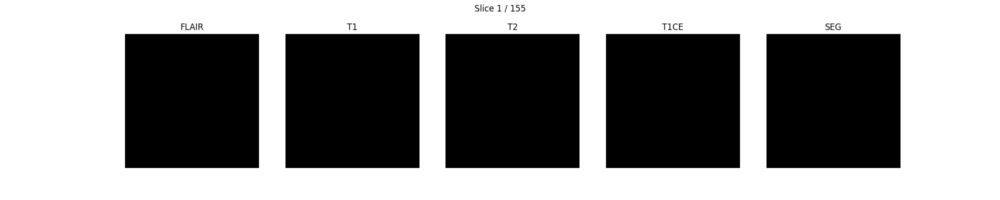

# Brain Tumour Segmentation V2: V-Net + Swin-style Transformer



3D brain tumour segmentation on **BraTS 2021** in PyTorch, using a hybrid architecture. A **V-Net** encoder–decoder captures local volumetric detail, and a **transformer bottleneck** (Swin-inspired multi-head self-attention) models long-range context across the whole tumour region.

This is the follow-up to my [3D U-Net baseline](https://github.com/viku03/Decathlon-Medical-Dataset).

## Architecture: `SWINNVNet`

```
Input (4 × 128³: FLAIR, T1, T1ce, T2)
  └─ InputBlock          Conv3d → GroupNorm → PReLU           (16 ch)
  └─ VNetDownBlock ×3    strided Conv3d downsampling + conv    (32 → 64 → 128 ch)
  └─ Transformer ×2      3D multi-head self-attention (8 heads) + GELU feed-forward,
                         residual connections + LayerNorm
  └─ VNetUpBlock ×3      ConvTranspose3d + skip-concat + conv  (64 → 32 → 16 ch)
  └─ OutputBlock         1×1×1 Conv3d → 3 channels
Output: Whole Tumour (WT), Tumour Core (TC), Enhancing Tumour (ET)
```

- **GroupNorm + PReLU** instead of BatchNorm, so training stays stable at small batch sizes (batch size 2).
- **Self-attention at the bottleneck only**, which keeps the quadratic attention cost affordable on a laptop GPU.
- **Composite loss** (`CombinedLoss`): 0.5 × Dice + 0.3 × BCE + 0.2 × Focal, to handle the heavy class imbalance of small enhancing-tumour regions.

## Pipeline

1. **Preprocessing** (`preprocessing_and_train.ipynb`)
   - Supports both NIfTI (`.nii.gz`) and DICOM inputs.
   - Resamples each case to 128³, clips outliers at the 99th percentile and normalises each modality over brain voxels.
   - Converts BraTS labels into the 3 overlapping regions (WT / TC / ET).
   - Caches each case as an **HDF5** file for fast I/O.
   - Train / val / test split: 700 / 150 / 150 cases.
2. **Data loading**: TorchIO `SubjectsDataset` / `SubjectsLoader`.
3. **Training**: AdamW (lr 3e-4, weight decay 1e-5), cosine-annealing LR schedule, early stopping (patience 10), periodic checkpoints. Runs on Apple Silicon (MPS), CUDA or CPU.
4. **Evaluation**: per-region Dice for WT, TC and ET, plus visual overlays (see GIF above).

## Repository structure

```
model.py                       # SWINNVNet, V-Net blocks, transformer blocks, Dice/BCE/Focal losses
dataset_combining.py           # Utilities for reorganising BraTS 2021 modality files
preprocessing_and_train.ipynb  # Preprocessing → HDF5, TorchIO dataloaders, training + evaluation
train.ipynb                    # Earlier training experiments
my_segmentation.gif            # Sample prediction visualisation
```

## Getting started

```bash
pip install torch torchio nibabel pydicom h5py scikit-image numpy matplotlib tqdm
```

1. Download the **RSNA-ASNR-MICCAI BraTS 2021** training set.
2. Update `NII_DATA_PATH` / `DCM_DATA_PATH` in the config cell of `preprocessing_and_train.ipynb`.
3. Run the notebook top to bottom. Preprocessed volumes are written to `preprocessed_data/`, and checkpoints to `model_outputs/`.

```python
from model import SWINNVNet
model = SWINNVNet(in_channels=4, out_channels=3, init_features=16, transformer_blocks=2)
```

## Tech stack

Python · PyTorch · TorchIO · NiBabel · pydicom · h5py · scikit-image · Matplotlib
